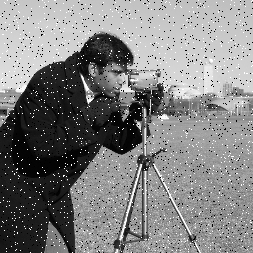

# Лабораторная работа - Фильтрация шума Salt-and-Pepper

## Описание

Реализована фильтрация изображений от шума типа «соль и перец» с применением 9-точечного медианного фильтра на CPU и GPU (CUDA). Входные данные: grayscale изображение в формате BMP. Выходные данные: отфильтрованное изображение и время обработки на CPU и GPU.

## О реализации

**CUDA-ядро `median_filter`** каждый поток обрабатывает один пиксель независимо. Для каждого пикселя считывается окно 3×3 через texture memory (`cudaTextureObject_t`), значения сортируются пузырьком, медиана (элемент [4]) записывается в выходной массив. Граничные пиксели обрабатываются через `cudaAddressModeClamp`.

**Texture memory** используется согласно заданию и обеспечивает эффективное кэширование при 2D-доступе к соседним пикселям аппаратный кэш GPU оптимизирован под такой паттерн доступа.

**CPU-функция `cpuMedianFilter`** реализует аналогичный алгоритм последовательно и используется для проверки корректности GPU-результата через побайтовое сравнение (`assert`).

**Параллелизация:** медианный фильтр естественно параллелизуется, так как каждый выходной пиксель вычисляется независимо результат зависит только от 9 пикселей входного изображения. Для изображения 512×512 запускается 262 144 потока одновременно.

## Результаты

Вычисления выполнялись в Google Colab. 
Тестовое изображение: `camera` из библиотеки scikit-image (512×512, grayscale), зашумлённое с вероятностью 5%.

Speedup = Time(CPU) / Time(GPU).

| Image Size | CPU Time (s) | GPU Time (s) | Speedup  |
|------------|--------------|--------------|----------|
| 512×512    | 0.031405     | 0.000243     | 129.128x |

Входное изображение (с шумом):

Результат после медианной фильтрации:

